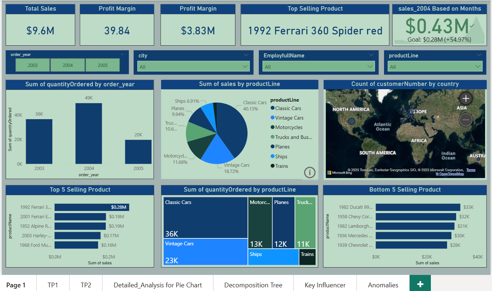

# 📊 Global Sales Dashboard – Power BI Project

## 🔍 Overview
This project presents an interactive Power BI dashboard developed to analyze global sales operations for a fictional company. Leveraging structured relational data, the dashboard highlights key business metrics, uncovers performance patterns, and enables data-driven decision-making across regions, products, and time.

## 🧰 Tools & Technologies
- **Power BI Desktop** (.pbix)
- **Microsoft Excel** (data source format)
- **Power Query Editor**
- **DAX (Data Analysis Expressions)**
- **Data Modeling & Relationships**

## 📁 Data Sources

The analysis is powered by 8 interconnected datasets, each representing a critical business entity:

| Dataset Name         | Description                                              |
|----------------------|----------------------------------------------------------|
| `customers.xlsx`     | Customer records including contact info and location     |
| `employees.xlsx`     | Employee details and reporting hierarchy                 |
| `offices.xlsx`       | Company office locations and regions                     |
| `orders.xlsx`        | Customer orders with status, dates, and references       |
| `order_details.xlsx` | Line-level product data linked to each order             |
| `payments.xlsx`      | Customer payment records with method and date            |
| `product.xlsx`       | Product catalog including pricing and product codes      |
| `productlines.xlsx`  | Product category metadata and descriptions               |

## 📌 Key Features & Insights

- **KPI Highlights**: Total Sales, Profit, Margin %, and Payment stats
- **Top Products**: Best and worst performers ranked by revenue
- **Product Line Analysis**: Sales breakdown by category (e.g., Classic Cars, Motorcycles)
- **Year-over-Year Comparison**: Sales trends from 2003 to 2005
- **Regional Performance**: Customer distribution and office-wise revenue
- **Employee Metrics**: Sales by employee and reporting structure
- **Interactive Slicers**: Filter data dynamically by year, country, product line, and more

## 🖼️ Dashboard Preview

## 🧠 Data Model Highlights

- **Star Schema** with `orders` as the central fact table
- Relationships defined through unique keys (`customerNumber`, `employeeNumber`, `productCode`, etc.)
- Custom DAX measures for KPIs such as **Total Profit**, **Average Order Value**, and **Sales Growth**

## 💡 How to Use

1. Clone or download the repository.
2. Open `SalesDashboard.pbix` in Power BI Desktop.
3. Explore the dashboard using built-in filters and slicers.
4. Modify or extend the model based on your analytical needs.

## 🚀 Future Enhancements

- Add calculated KPIs like Customer Lifetime Value (CLTV)
- Integrate a data refresh pipeline using Power BI Service
- Introduce RFM analysis and clustering for customer segmentation

## 🙋‍♂️ About Me

I'm **Satyam Gupta**, an aspiring Data Analyst with a passion for transforming data into insights. Currently working as an Office Executive, I'm actively seeking opportunities in **Data Science** or **Business Intelligence** roles. Check out more of my work on [GitHub](#) and feel free to connect!

---

